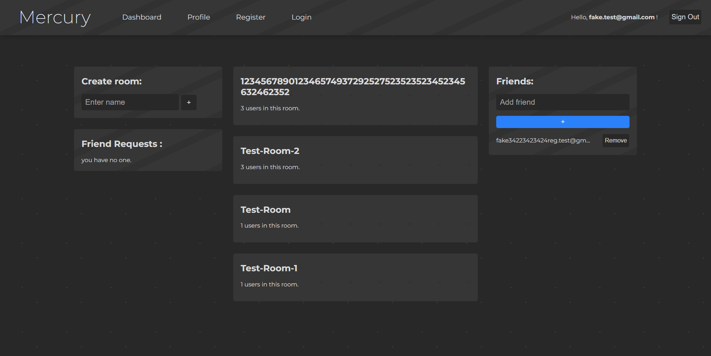
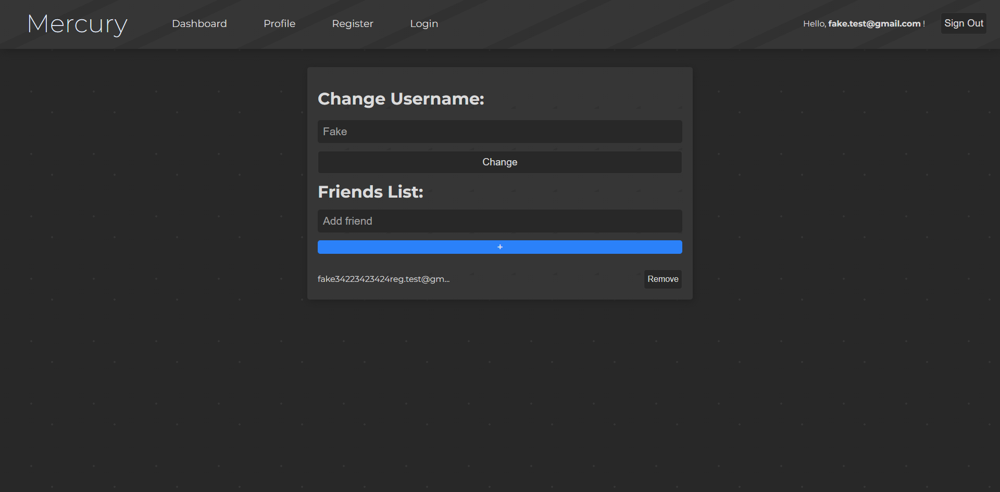
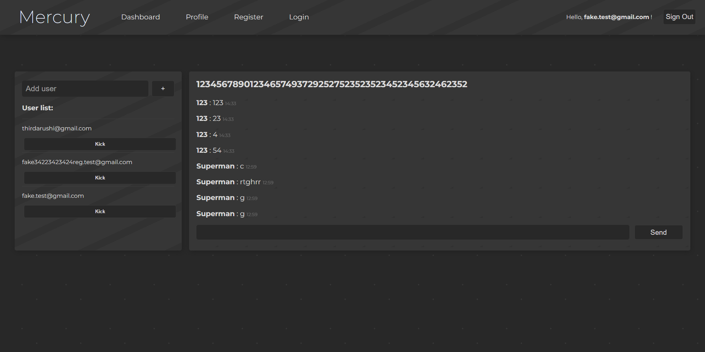
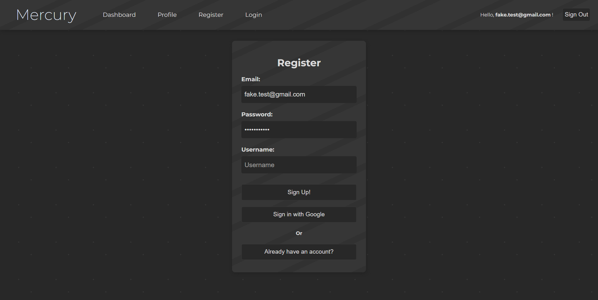

# Firebase Texting App
This project uses Firebase to create a texting app. The database and authentication is handled by firebase. This app is fully responsive. 

## Rooms and Contacts
Users can create and add people to rooms. If two users are friends, a "contact" is created. Contacts will still save the messages even after removing friends. Both rooms and contacts only show the last 30 messages.

## Register
Once a user registers, they will create a document that contains the following: email, username, friend requests array, and a friends array.

## Authorization
Users cannot view the dashboard or profile page without being logged in. In addition, users that try to access a room or a contact without permission will be redirected to the dashboard.

&nbsp;

&nbsp;

&nbsp;

&nbsp;

### Resources used:
* Firebase
* React
* React-Router
